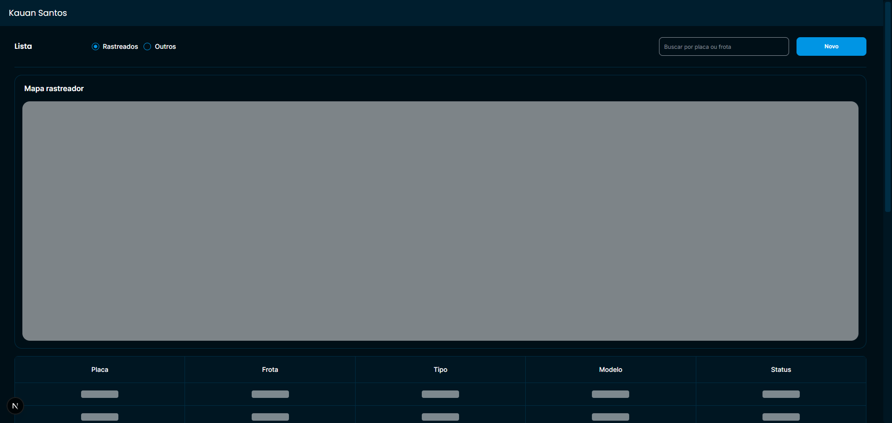
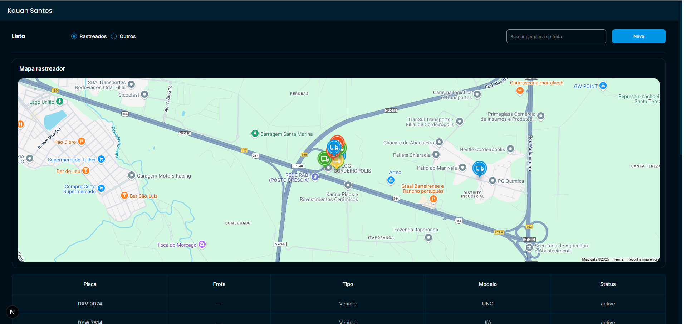
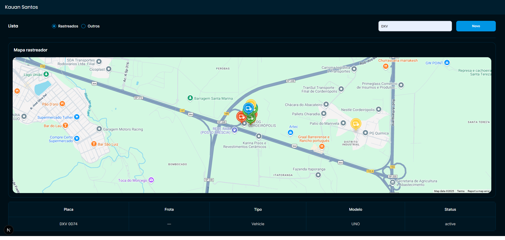
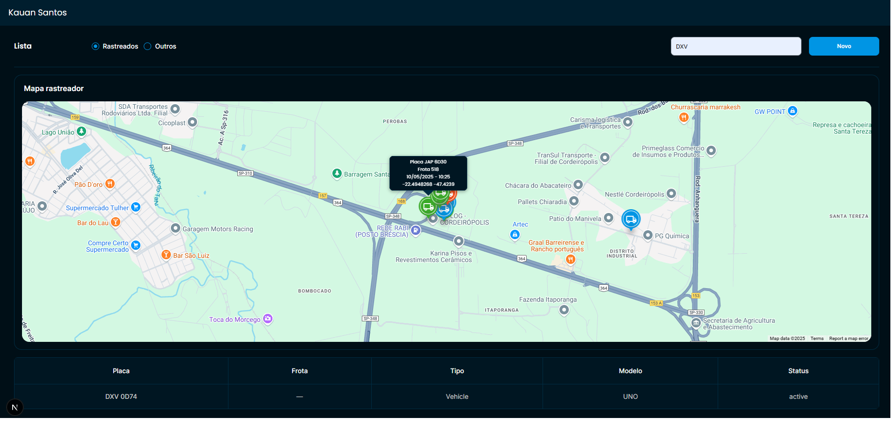
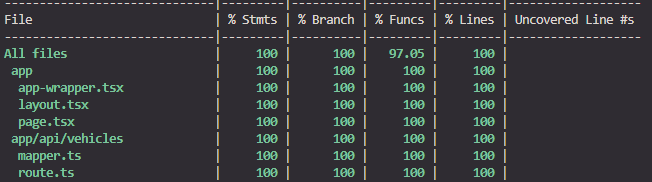

# Teste Fullstack Control 361

Teste desenvolvido para vaga fullstack na Control 361

## Deploy

Para visualizar esse projeto acesse:

📍 <a href="https://vehicles-google-maps-visualizer.vercel.app" target="_blank" > Teste Fullstack Control 361 - Kauan Santos</a>

# Layout

## Loading

[]()

## Default
[]()

## Com filtro
[]()

## Detalhes do Veículo
[]()


## Requisitos

- ✅ O mapa deve apresentar todos os veiculos simultaneamente e ser atualizada a cada 2 minutos automáticamente.

- ✅ A lista deve carregar 20 veiculos e ter um carrossel infinito que carrega mais veiculos sempre que scrolamos até o final da lista.

- ✅ Ao clicar em um veiculo da tela, apresentar os detalhes do veiculo.

- ✅ Entre os detalhes do veiculo existe um link que abre o google maps nas coordenadas do veiculo.

- ✅ Filtro pela placa do veiculo e pelo numero de frota.


## Coverage de Testes

[]()


## Tecnologias utilizadas

- Nextjs
- React
- Typescript
- Tailwindcss
- React Query
- React Hook Form
- Zod
- Axios
- Jest / React Testing Library
- Shadcn

## Variáveis de Ambiente

Para rodar esse projeto, você vai precisar adicionar as seguintes variáveis de ambiente no seu .env.local copie o .env.example e faça o setup no google console para obter suas credencias do google

`API_URL` <br/>
`TOKEN_API_KEY` <br/>
`NEXT_PUBLIC_GOOGLE_MAPS_API_KEY` <br/>
`NEXT_PUBLIC_GOOGLE_MAPS_MAP_ID`

## Rodando Localmente

```bash

$ git clone https://github.com/zkauansantos/vehicles-google-maps-visualizer.git

$ cd vehicles-google-maps-visualizer

$ pnpm install

$ pnpm dev
```
